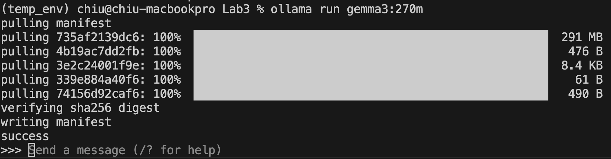
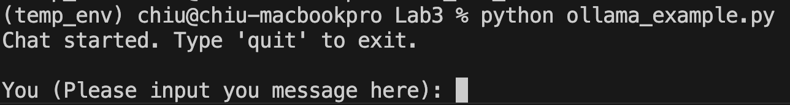

# 人本計算實驗(Lab3)

## 環境建置
- 安裝Ollama環境，到 https://ollama.com/ 下載並安裝最新的Ollama
- 在Terminal輸入`ollama run gemma3:270m`
- 之後Terminal會出現對話框，內容如下

- 接下來可以試著跟他聊天，如果要關閉的話輸入`/bye`就可以退出聊天了

## Ollama基本指令介紹
- 開啟Ollama服務 (通常預設是開啟的)
```bash
ollama serve
```
- 執行指定model (如果model不存在的話會自動下載)
```bash
ollama run <model_name>  #例如 ollama run gemma3:270m
```
- 執行指定model並印出每秒可以處理多少token
```bash
ollama run <model_name> --verbose
```
- 下載指定model(純下載，不會執行)
```bash
ollama pull <model_name>
```
- 列出當前本地有的model
```bash
ollama list
```
- 關閉指定model
```bash
ollama stop <model_name>
```
-　查看更多指令說明
```bash
ollama help
```

### 使用Python控制Ollama

- 進入虛擬環境，並安裝Ollama相關套件
```bash
conda activate UAV_env
pip install ollama openai
```
- 執行`local_llm_test.py`
```bash
python local_llm_test.py
```
- 如果看到以下畫面且可以對話，python環境就算是建置完成了
